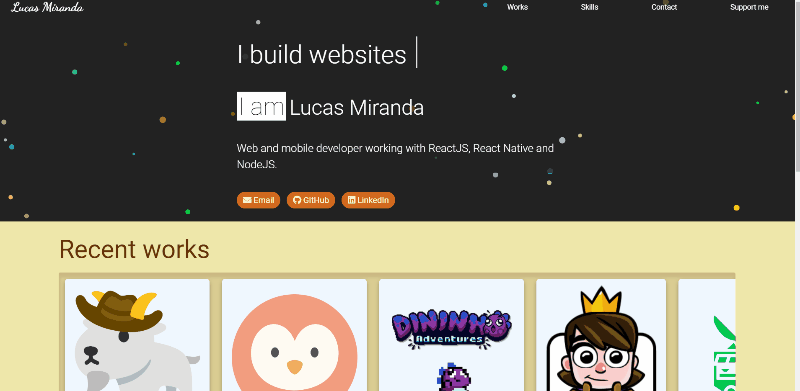

# Lucas Miranda | @lucas-lm

Welcome to my personal website repo. Simple pages written with the good old vanilla javascript, html and css.

# Table of Contents
  - [About](#about)
  - [Technologies](#technologies)
  - [Contributing](#contributing)
  - [To do](#to-do)

## About

This is my personal website where I share some contact information, showcase done works and my expertises.
It is a simple website made in vanilla javascript, html, css and hosted by github pages.

## Technologies

- [HTML](https://developer.mozilla.org/en-US/docs/Web/Guide/HTML/HTML5)
- [CSS](https://developer.mozilla.org/en-US/docs/Archive/CSS3)
- [javascript](https://developer.mozilla.org/en-US/docs/Web/JavaScript)

## Contributing

All contributions are welcome:

- ⭐️ Star the project
- 🐛 Find and report issues
- 📥 Submit PRs to help solve issues or add features

## To do

- [ ] Blog page
- [ ] Blog articles page
